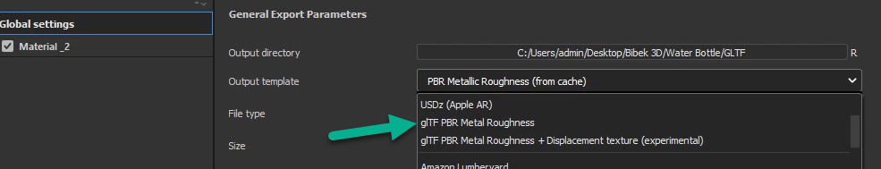
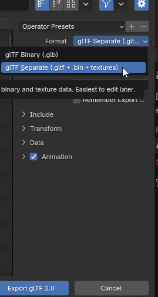
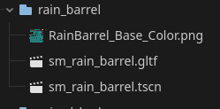
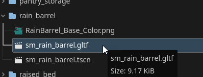
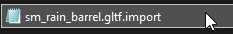
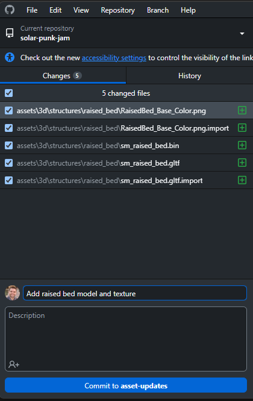
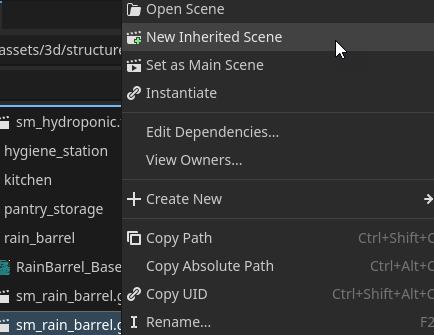

<!-- Generated by tools/pipeline/pipeline.py render pipeline from pipeline.yaml. Do not edit by hand; edit pipeline.yaml and re-run the renderer. -->

# SolarPunk Jam Asset Pipeline

How an asset gets from a request to a shipped level. Five phases, all of them loops. The static 3D pipeline is documented in full; the 2D and audio pipelines are stubs that record only what is already enforced in code.

> The board drew the five phases as a left-to-right sequence with a single "Repeat" arrow. That was the reason for writing this file: in practice every phase is re-entered, and assets flow backwards constantly. The `edges` list below records the rework and repeat paths the board omitted.
>
> Derived from [`SolarPunk Jam - Asset Pipeline.svg`](../../documentation/SolarPunk%20Jam%20-%20Asset%20Pipeline.svg) (superseded).

## Who does what

| Role | Responsibility |
| --- | --- |
| **Artist** | Models and textures the asset in Blender and Substance Painter. |
| **Integrator** | Owns the Godot-side files that wrap an incoming model. Works in files the artists never touch, so re-exports can never clobber integration work. |
| **Programmer** | Adds logic and components to a model, producing a drop-in prefab. |
| **Level Designer** | Assembles prefabs into playable levels. |

---

# Static 3D Asset Pipeline

A static prop or building, from a placeholder cube to a prefab placed in a level. Named "static" because these assets carry no skeletal animation; skeletal meshes follow the same route with an sk_ prefix.

## The shape of it

Solid arrows move an asset forward. **Dashed** arrows are rework - work going back to an earlier owner. **Thick** arrows are repeats of the same work. The dashed and thick arrows are the pipeline; the solid ones are just the happy path.

```mermaid
flowchart LR
  subgraph art["Art"]
    direction TB
    art__claim_asset["Claim an asset"]
    art__create_placeholder["Save a placeholder"]
    art__model["Model the asset"]
    art__texture["Texture the asset"]
    art__export_gltf["Export glTF from Blender"]
  end
  subgraph update_in_place["Update in place"]
    direction TB
    update_in_place__update_asset["Update the asset"]
    update_in_place__place_files["Place the files in the asset directory"]
    update_in_place__import_into_godot["Import into Godot"]
    update_in_place__verify_import_sidecar["Verify the .import sidecars exist"]
    update_in_place__commit["Commit the files"]
  end
  subgraph integration["Integration"]
    direction TB
    integration__create_container_scene["Create the model container scene"]
    integration__write_model_spec["Write the model's spec file"]
    integration__add_override_materials["Add override materials"]
    integration__create_spatial_shader["Create a spatial shader"]
  end
  subgraph programming["Programming"]
    direction TB
    programming__create_prefab_scene["Create the prefab scene"]
  end
  subgraph level_design["Level Design"]
    direction TB
    level_design__create_level_scene["Create the level scene"]
    level_design__populate_level["Populate the level with prefabs"]
  end

  art__claim_asset --> art__create_placeholder
  art__create_placeholder --> art__model
  art__model --> art__texture
  art__texture --> art__export_gltf
  art__export_gltf --> update_in_place__place_files
  update_in_place__update_asset --> update_in_place__place_files
  update_in_place__place_files --> update_in_place__import_into_godot
  update_in_place__import_into_godot --> update_in_place__verify_import_sidecar
  update_in_place__verify_import_sidecar --> update_in_place__commit
  update_in_place__commit --> integration__create_container_scene
  integration__create_container_scene --> integration__write_model_spec
  integration__create_container_scene --> integration__add_override_materials
  integration__add_override_materials --> integration__create_spatial_shader
  integration__create_container_scene --> programming__create_prefab_scene
  programming__create_prefab_scene --> level_design__create_level_scene
  level_design__create_level_scene --> level_design__populate_level
  update_in_place__commit == "Repeat" ==> update_in_place__update_asset
  level_design__populate_level == "repeat" ==> level_design__create_level_scene
  art__texture -. "rework" .-> art__model
  update_in_place__verify_import_sidecar -. "rework" .-> update_in_place__place_files
  integration__create_container_scene -. "rework" .-> update_in_place__update_asset
  integration__write_model_spec -. "rework" .-> art__model
  integration__add_override_materials -. "rework" .-> art__texture
  programming__create_prefab_scene -. "rework" .-> integration__create_container_scene
  level_design__populate_level -. "rework" .-> programming__create_prefab_scene

  linkStyle 18,19,20,21,22,23,24 stroke:#c2410c,stroke-width:2px;
  linkStyle 16,17 stroke:#1d4ed8,stroke-width:3px;
```

### When work goes backwards

| | From | Back to | Because |
| --- | --- | --- | --- |
| repeat | `update_in_place.commit` | `update_in_place.update_asset` | The asset needs another revision. This is the loop most assets live in. |
| repeat | `level_design.populate_level` | `level_design.create_level_scene` | Playtesting calls for a new level variation or version. |
| rework | `art.texture` | `art.model` | The UVs or normals need fixing before texturing can continue. |
| rework | `update_in_place.verify_import_sidecar` | `update_in_place.place_files` | A .import sidecar was not generated, usually because a file was copied outside Godot. |
| rework | `integration.create_container_scene` | `update_in_place.update_asset` | The imported model needs a change only the artist can make. |
| rework | `integration.write_model_spec` | `art.model` | The glTF validator reports FAIL against the spec - wrong dimensions, over the poly budget, or a missing root node. |
| rework | `integration.add_override_materials` | `art.texture` | The exported maps are wrong or missing, so no material can be built from them. |
| rework | `programming.create_prefab_scene` | `integration.create_container_scene` | The prefab needs material or hierarchy changes that belong in the container scene. |
| rework | `level_design.populate_level` | `programming.create_prefab_scene` | The prefab is missing behaviour the level needs. |

## Conventions

### Naming

| What | Pattern | Example | Not this |
| --- | --- | --- | --- |
| static mesh gltf | `sm_{object}.gltf or sm_{object}_{variation}.gltf` | `sm_rain_barrel.gltf` | `sm_RainBarrel.gltf` |
| skeletal mesh gltf | `sk_{object}.gltf` | `sk_wolf.gltf` | `sm_wolf.gltf` |
| gltf binary buffer | `{mesh_stem}.bin` | `sm_rain_barrel.bin` | `rain_barrel.bin` |
| texture map | `t_{asset_name}_{descriptor}.png or t_{asset_name}_{descriptor}_{variant}.png` | `t_rain_barrel_basecolor.png` | `T_RainBarrel_BaseColor.png` |
| model container scene | `{mesh_stem}.tscn` | `sm_rain_barrel.tscn` | `rain_barrel.tscn` |
| prefab scene | `prefab_{object}.tscn or prefab_{object}_{variation}.tscn` | `prefab_rain_barrel.tscn` | `rain_barrel_prefab.tscn` |
| level scene | `level_{level}.tscn or level_{level}_{variation}_{version}.tscn` | `level_main.tscn` | `main_level.tscn` |
| godot import sidecar | `{full_filename}.import` | `sm_rain_barrel.gltf.import` | `sm_rain_barrel.import` |
| model spec | `{model_filename}.spec.yaml` | `sm_rain_barrel.gltf.spec.yaml` | `sm_rain_barrel.spec.yaml` |

- **static mesh gltf** - Static mesh. The variation suffix is optional - an object with only one form does not need one.
- **skeletal mesh gltf** - Skeletal mesh - a model with an armature.
- **gltf binary buffer** - The buffer Blender writes beside a separate-format glTF. Its name is generated - never rename it, the .gltf references it by name.
- **texture map** - Same [prefix]_[name]_[descriptor]_[variant] shape as the meshes, with the texture prefix t_. Set this as the filename pattern in the exporter rather than renaming files afterwards - see the never_hand_rename_textures rule.
- **model container scene** - The inherited scene wrapping a model. Shares the mesh's stem and sits in the same directory, so the pair is obvious at a glance.
- **level scene** - Test levels take the same name with a test_ prefix.
- **godot import sidecar** - Generated by Godot. Keeps the asset's full filename including its original extension - sm_rain_barrel.gltf.import, not sm_rain_barrel.import.
- **model spec** - Machine-checkable acceptance criteria for one model, read by the glTF validator. Sits beside the .gltf.

### Where things live

- `assets/art/3d/{category}/{object}/`
  - Everything belonging to one 3D object: the mesh, its buffer, its textures, every .import sidecar, and the model container scene. One directory per object, so a re-export touches nothing else.
  - e.g. `assets/art/3d/structures/raised_bed/`
- `prefabs/{category}/`
  - Prefab scenes, grouped by the same category names used under assets/art/3d/.
  - e.g. `prefabs/structures/`
- `levels/`
  - Shipping level scenes.
  - e.g. `levels/level_main.tscn`
- `test/levels/`
  - Scratch levels for trying assets out. Not shipped.
  - e.g. `test/levels/test_level_main.tscn`

### Rules that apply everywhere

- **Required** — Name every asset [prefix]_[asset_name]_[descriptor]_[variant], where the prefix says what kind of thing the file is. Descriptor and variant are only used where they mean something.
  - *Why:* Unreal's convention, in lowercase. The prefix sorts related files together and tells you what a file is before you open it, which matters most in a flat FileSystem dock.
- **Required** — Name every file you author in lowercase, with underscores between words.
  - *Why:* Godot generates lowercase names for everything it creates. Going with it is cheaper than having every contributor change their editor settings, or re-editing what Godot generates each time.
- **Required** — Deliver models as glTF. Never commit .fbx.
  - *Why:* FBX is a proprietary format with inconsistent importer behaviour across DCCs.
- **Required** — Commit the .import sidecar Godot generates for every asset file.
  - *Why:* Without the sidecar, the asset's resource UID differs on every machine, so scene references break for everyone but you.

### Files this pipeline produces

| File | Extensions | Generated? | Must ship with |
| --- | --- | --- | --- |
| **Blender source file** | `.blend` | authored | - |
| **Static mesh (glTF)** | `.gltf` | generated | `gltf_binary_buffer`, `godot_import_sidecar` |
| **glTF binary buffer** | `.bin` | generated | - |
| **Texture map** | `.png`, `.jpg`, `.jpeg` | generated | `godot_import_sidecar` |
| **Godot import sidecar** | `.import` | generated | - |
| **Model spec** | `.yaml` | authored | - |
| **Model container scene** | `.tscn` | authored | - |
| **Override material** | `.tres` | authored | - |
| **Spatial shader** | `.gdshader` | authored | - |
| **Prefab scene** | `.tscn` | authored | - |
| **Level scene** | `.tscn` | authored | - |

- **Blender source file** - The editable model. Not consumed by Godot.
- **Texture map** - Written by the exporter, but under a filename pattern you configure. Generated in the sense that you must not edit or rename it by hand.
- **Godot import sidecar** - Holds the resource UID and import settings. Godot writes it on first import; it must be committed.
- **Model spec** - Acceptance criteria for one model.
- **Model container scene** - A scene inherited from the glTF. Owned by integration, never touched by the artists, so a re-export cannot clobber material overrides.
- **Prefab scene** - A model container plus the logic that makes it a working game object.

---

## 1. Art

**Owner:** Artist

Model and texture the asset, then export it as glTF.

> **This is a loop.**
> One turn covers: One asset from the asset list.
> You come back when: Art-direction feedback, a failed spec check from the glTF validator, or an integrator finding the model unusable.
> You are out when:
> - The exported .gltf opens in Godot without import errors.
> - Dimensions, pivot and poly count match the asset's spec.

### Claim an asset

`art.claim_asset`

Pick an unclaimed asset from the asset list and open or assign its issue.

1. Find the asset on the asset list.
2. Assign yourself its "Create 3D model" issue, or open one if none exists.
3. Note the required dimensions in metres and the destination directory.

For agents: partly automatable. Done when: The issue is assigned and names a destination directory.

### Save a placeholder

`art.create_placeholder` &middot; Blender

Put a stand-in glTF in the final destination directory before doing any real work, so integration and level design can start immediately.

1. Make a geometric shape at the asset's real dimensions. A box is fine.
2. Export it to the destination directory under the final filename.
3. Put a placeholder in every destination directory the asset needs.

- **Recommended** — Build the placeholder at the asset's real dimensions.
  - *Why:* Level designers block out space against it. A wrongly sized placeholder means the level gets rebuilt when the real asset lands.
- **Required** — Give the placeholder its final filename, not a temporary one.
  - *Why:* Every later step replaces files by name. A placeholder named something else has to be deleted by hand, and every reference to it rebound.

For agents: not automatable (needs a GUI).

### Model the asset

`art.model` &middot; Blender

Build the real geometry.

1. If the asset is a vehicle, build it with tools/blender-vehicle/ rather than by hand - it produces the geometry, UVs, a baked atlas, collision proxies and a validated glTF from one Python file, and its README records the traps that cost a rebuild to find. Get the blockout approved before the bake.
2. Model to the dimensions on the issue, in metres.
3. Set the pivot to the right place - usually bottom centre - and align it to the world origin.
4. UV unwrap, creating islands as needed.
5. Check the normals.
6. Keep the poly count inside the asset's budget.

- **Required** — No mesh may have another mesh as a child.
  - *Why:* It breaks Godot's collision shape generation.
- **Required** — Do not end an object name in a word Godot's importer reads as a node type - wheel, vehicle, rigid, occ, noimp, cycle or loop - unless that node type is what you want.
  - *Why:* Godot's scene importer reinterprets node names, and it matches "_wheel" and "$wheel" as well as "-wheel". That is the same mechanism that makes -convcolonly work, so it cannot be switched off, and it means an ordinary descriptive name can silently change a node's class: a mesh named steering_wheel arrives as a VehicleWheel3D, a physics node that only functions parented to a VehicleBody3D. The file is valid glTF throughout, so nothing but this check can see it. Rename the object - steering_wheel_rim - or, if the Godot node type really is the intent, list the suffix in the spec's godot_node_suffixes_allowed.
- **Required** — Keep collision proxies inside the visual mesh they stand in for.
  - *Why:* The size checks measure the whole file, so a proxy sticking out past the art becomes the model's declared width, height or depth - and the resulting failure points at a number that is invisible in every render. A centimetre of slack is allowed, because a proxy hugging a curved surface routinely pokes a few millimetres past the faceted mesh approximating it.
- **Required** — Align the pivot point to the world origin.
  - *Why:* Otherwise every placement in every level carries a compensating offset that nobody remembers to apply.
- **Required** — Point the model's front down +Y in Blender.
  - *Why:* +Y is the axis you can see yourself working against in Blender, and it is the one that lands where the engine wants it. The export converts Blender +Y to -Z in the glTF, and -Z is Godot's forward - Vector3.FORWARD is (0, 0, -1). So a model built to +Y in Blender is a model whose front points where look_at() and -basis.z already point, with no compensating rotation anywhere.
- **Required** — Stay within the poly count budget in the model's spec file.
  - *Why:* This is a web-first jam build; the frame budget is small.

For agents: partly automatable.

### Texture the asset

`art.texture` &middot; Adobe Substance 3D Painter

Paint the model and export PBR maps that Godot can read directly.

1. Texture the model in Substance Painter.
2. Open File > Export Textures.
3. Set Output template to "glTF PBR Metal Roughness".
4. Set the output directory to the asset's directory under assets/art/3d/{category}/{object}/.
5. Set the export filename pattern so the files land as t_{asset_name}_{descriptor}, lowercase.

*Pick "glTF PBR Metal Roughness" - not the Displacement variant, and not USDz or Lumberyard.*

- **Required** — Configure the exporter's filename pattern to emit t_{asset_name}_{descriptor}.png, rather than renaming files after the fact.
  - *Why:* The .gltf references each image by URI. Renaming afterwards breaks that reference, and the next export puts the old name back. Setting the pattern once makes every future export correct for free.
- **Required** — Set the Substance Painter output template to "glTF PBR Metal Roughness".
  - *Why:* It writes exactly the maps the glTF metallic-roughness model expects, with the channel packing Godot assumes. Any other template needs the maps rewired by hand on import.

For agents: not automatable (needs a GUI).

### Export glTF from Blender

`art.export_gltf` &middot; Blender

Export as separate glTF - not GLB - into the asset's directory.

1. File > Export > glTF 2.0.
2. In the Format dropdown choose "glTF Separate (.gltf + .bin + textures)".
3. Export into assets/art/3d/{category}/{object}/ using the sm_ or sk_ prefixed name.

*The Format dropdown, with "glTF Separate (.gltf + .bin + textures)" selected.*

- **Required** — Export "glTF Separate", never "glTF Binary (.glb)".
  - *Why:* Separate keeps geometry, buffer and textures as distinct files, so a texture can be re-exported without touching the mesh and a diff shows what actually changed. GLB is one opaque blob.
- **Required** — Prefix the filename sm_ for a static mesh, sk_ for a skeletal mesh.
  - *Why:* The prefix tells an integrator whether to expect an armature before opening the file.
- **Required** — Check that the exported .gltf faces -Z. A model facing +Y in Blender becomes -Z in the glTF when the export is correct.
  - *Why:* The .gltf is the file that gets validated and the file the game loads; the .blend is only what the artist looks at. -Z is Godot's forward, so this is the axis that makes the model face the way the engine thinks it does. Note this is deliberately not the glTF spec's own +Z-front convention: the spec is written for viewers, and matching Godot matters more here than matching Sketchfab. Do not "fix" it back to +Z. Measured against a real export rather than assumed - see the reference asset in assets/art/3d/example_cubes_facing, whose nub sits on Blender +Y and lands on glTF -Z.
- **Required** — The exported .gltf must be +Y up.
  - *Why:* +Y up is the glTF convention and what Godot expects. Blender's +Z up becomes +Y up through the same export conversion.

For agents: not automatable (needs a GUI).

---

## 2. Update in place

**Owner:** Artist

Drop the exported files over the existing ones, let Godot import them, and commit. This is the loop an asset spends most of its life in.

> **This is a loop.**
> One turn covers: One revision of one asset.
> You come back when: Any further change to the asset - more detail, better UVs, new textures.
> You are out when:
> - The asset renders correctly in Godot.
> - Every file and its .import sidecar are committed.

### Update the asset

`update_in_place.update_asset` &middot; Blender

Make the next revision and re-export over the same filenames.

1. Add mesh detail.
2. UV unwrap.
3. Add or update textures.
4. Re-export, replacing the existing files.

- **Required** — Always replace the existing file with a file of the same name.
  - *Why:* Every scene, prefab and level that references this asset does so by path. A new filename orphans all of them, and the model container scene an integrator built has to be rebuilt.

For agents: not automatable (needs a GUI).

### Place the files in the asset directory

`update_in_place.place_files`

Copy the exported .gltf, .bin and textures into assets/art/3d/{category}/{object}/, overwriting what is there.

1. Copy the exported files into the asset's directory.
2. Overwrite the existing files; do not rename anything.

*The older exporter-given form, still present in committed assets. RainBarrel_Base_Color.png would now export as t_rain_barrel_basecolor.png - but change it at the exporter and re-export, never by renaming the file here.*

- **Required** — Never rename a texture by hand. If a filename is wrong, fix the exporter's filename pattern and re-export.
  - *Why:* The .gltf references each image by URI, so a hand-rename breaks the model until someone edits the .gltf too - and the next export puts the old name back. Re-exporting rewrites both at once.
- **Recommended** — Keep every file for an object inside that object's own directory.
  - *Why:* A re-export then touches exactly one directory, and a reviewer can see the whole asset in one place.

For agents: fully automatable. Done when: The destination directory contains the .gltf, .bin and every texture the .gltf references.

### Import into Godot

`update_in_place.import_into_godot` &middot; Godot Engine

Drag the files into Godot's FileSystem dock so it generates the .import sidecars.

1. Open the project in Godot.
2. Drag and drop the files into the FileSystem window.
3. Wait for the import to finish.

*The imported sm_rain_barrel.gltf in Godot's FileSystem dock.*

- **Required** — Let Godot import the files rather than only copying them in the OS.
  - *Why:* The import is what generates the .import sidecar, and the sidecar is what fixes the resource UID across machines.

For agents: partly automatable. Done when: An .import file exists for every added asset file.

### Verify the .import sidecars exist

`update_in_place.verify_import_sidecar` &middot; Operating system file explorer

Confirm in the OS file explorer that each asset gained its .import file.

1. Open the asset's directory in your operating system's file explorer.
2. Confirm there is a .import file next to each asset file.

*sm_rain_barrel.gltf.import, visible only outside the Godot editor.*

- *Worth knowing* — Check in the OS explorer, not in Godot's FileSystem dock.
  - *Why:* Godot hides .import files from its own dock, so they look absent there.

For agents: fully automatable. Done when: Every asset file in the directory has a matching .import sibling.

### Commit the files

`update_in_place.commit` &middot; GitHub Desktop

Stage every changed file, including the sidecars, and commit.

1. Open GitHub Desktop on the repository.
2. Confirm the changed-files list includes the .gltf, the .bin, every texture, and every .import.
3. Write a message naming the asset, then commit and push.
4. Open a pull request.

*Five files for one asset staged together - the texture, the buffer, the mesh, and both .import sidecars.*

- **Required** — Commit the asset, its buffer, its textures and all .import files together.
  - *Why:* A partial commit leaves the branch in a state where the model cannot be imported, which fails CI for whoever pushes next.

For agents: partly automatable. Done when: git status is clean after the commit.

---

## 3. Integration

**Owner:** Integrator

Wrap the incoming model in files the artists never touch, so material and shader work survives every re-export.

> **This is a loop.**
> One turn covers: One model.
> You come back when: A re-export changes the model's material slots, or the look needs further work.
> You are out when:
> - A model container scene exists beside the model.
> - The model renders as intended in a test level.

### Create the model container scene

`integration.create_container_scene` &middot; Godot Engine

Make an inherited scene from the glTF and save it beside the model.

1. Select the .gltf in Godot's FileSystem dock.
2. Right-click and choose "New Inherited Scene".
3. Save it in the same directory as the model, using the model's stem with a .tscn extension.

*Right-click the .gltf and choose "New Inherited Scene".*

- **Required** — Save the container scene in the same directory as the model.
  - *Why:* The pair stays obvious, and moving the object moves everything at once.
- **Required** — Only integration edits this file.
  - *Why:* It is the whole point of the file. Artists overwrite the .gltf freely; the container scene is where changes that must survive that overwrite live.

Why make this "model container scene"?

So there is a file owned by the team integrating assets that will not be touched by those uploading models and textures. Modifications such as material settings go in this file, and a re-export of the .gltf cannot destroy them.

For agents: partly automatable. Done when: The .tscn exists beside the .gltf and opens without errors.

### Write the model's spec file

`integration.write_model_spec`

Record the model's acceptance criteria as {model}.gltf.spec.yaml so CI can check the next re-export against them instead of a human remembering.

1. Create {model_filename}.spec.yaml beside the .gltf.
2. Fill in width, height and depth in metres from the asset's issue.
3. Set poly_count_budget.
4. Set up_direction to "+Y" and facing_direction to "-Z" - these are glTF-space axes, not Blender's.
5. Declare collision_expected and navigation_expected.
6. List the textures the model must reference.
7. Check it before you commit: python .github/scripts/validate-model-files.py path/to/sm_thing.gltf. It prints the model's measured width, height, depth and triangle count, so you can read the real numbers off a model with no spec and write them down rather than guessing. It also rejects a misspelled key, which CI used to ignore in silence.

- **Required** — Name the spec after the model's full filename, including .gltf.
  - *Why:* The validator looks for exactly {gltf_path}.spec.yaml and silently skips anything else.
- **Recommended** — Take the dimensions from the asset's issue, not from the model as built.
  - *Why:* Copying the built model's measurements makes the check tautological. The spec exists to catch the model drifting away from what was asked for.

What happens if a model has no spec file?

It passes. The validator reports geometry facts and previews but cannot fail anything. Adding a spec is how a model gains acceptance criteria at all.

Which axis do I put in the spec file?

glTF-space axes: up_direction "+Y", facing_direction "-Z". The artist works to +Y forward in Blender and the export converts it to -Z; the spec describes the exported file, which is the one being validated. -Z is Godot's forward, which is why it is the target rather than the glTF spec's +Z.

Is facing_direction actually checked?

No - it is a declaration for reviewers, not something CI can verify. Nothing in a glTF marks which side of a mesh is the face, so no tool can read the facing off the geometry. What gltf_axes.py measures is the rotation on the node chain, which is a different thing that happens to be reported in the same units. Two exports of the same model, one built facing +Z and one facing -Z, both report "+Z" once their transforms are applied. Treat facing_direction as the written record of what the model is supposed to do, and confirm the actual facing by looking at the render in the PR comment.

Then what do the axis checks actually catch?

up_direction is real: a Z-up export leaves a rotation on the node chain and fails. facing_direction catches the same class of problem - an export that skipped or botched the axis conversion - and nothing else. A model modelled back-to-front passes both. A model whose orientation cannot be determined is reported as UNKNOWN rather than passed. The related check that does bite is unapplied_transforms (tools/gltf-validator/gltf_transforms.py), which fails a model whose node chain still carries a rotation or scale. Until that passes, neither axis number describes the geometry at all.

For agents: fully automatable. Done when: The spec validates against schemas/model-spec.schema.json.

### Add override materials

`integration.add_override_materials` &middot; Godot Engine

Combine the incoming textures into materials on the container scene.

1. Open the model container scene.
2. Add an override material to each mesh surface that needs one.
3. Wire the exported maps into the material's channels.

- **Required** — Put override materials on the container scene, never on the imported .gltf.
  - *Why:* The next re-export discards anything set on the imported resource.

For agents: partly automatable. Done when: The container scene renders with the intended materials in an editor screenshot.

### Create a spatial shader

`integration.create_spatial_shader` &middot; Godot Engine

Where a plain material is not enough, write a spatial shader controlling how the model and its textures render.

1. Create a .gdshader with shader_type spatial.
2. Assign it via a ShaderMaterial on the container scene.

For agents: partly automatable. Done when: The shader compiles with no errors in the Godot output log.

---

## 4. Programming

**Owner:** Programmer

Turn an integrated model into a prefab that works when dropped into a level.

> **This is a loop.**
> One turn covers: One prefab.
> You come back when: A level designer finds the prefab missing behaviour, or the design changes.
> You are out when:
> - The prefab works as-is when instanced into a test level.

### Create the prefab scene

`programming.create_prefab_scene` &middot; Godot Engine

A new scene holding the model container plus all the logic, scripts and components that make it a game object.

1. Create a new scene at prefabs/{category}/prefab_{object}.tscn.
2. Instance the model container scene into it.
3. Add the scripts, collision, areas and components the object needs.

- **Required** — A prefab must work as-is when dropped into a level.
  - *Why:* That is the contract level design relies on. A prefab needing per-placement wiring pushes programming work into every level.
- *Worth knowing* — Skip the prefab for a purely decorative object - use the model container scene directly.
  - *Why:* Objects with no logic in them gain nothing from a prefab layer but cost a file and an indirection.

Why make this "prefab scene"?

This file has all logic, code and additional components that add functionality to the model. It can be dropped into the game and essentially work as-is as an in-game asset.

Does every model need a prefab?

No. For purely decorative assets no prefab scene is necessary, as they should have no logic in them.

For agents: partly automatable. Done when: The prefab instances into a test level and the project runs without errors.

---

## 5. Level Design

**Owner:** Level Designer

Assemble prefabs into levels.

> **This is a loop.**
> One turn covers: One level.
> You come back when: Playtest feedback, or new prefabs becoming available.
> You are out when:
> - The level is playable start to finish.
> - It is registered in globals/scene_manager.gd if it ships.

### Create the level scene

`level_design.create_level_scene` &middot; Godot Engine

A new .tscn under levels/, or under test/levels/ for a scratch level.

1. Create a new scene named level_{level}.tscn.
2. Save it under levels/, or test/levels/ with a test_ prefix for a scratch level.
3. Register shipping levels in globals/scene_manager.gd.

For agents: partly automatable. Done when: The scene opens and the project runs.

### Populate the level with prefabs

`level_design.populate_level` &middot; Godot Engine

Instance prefabs to give the level its content and functionality.

1. Instance prefabs from prefabs/ into the level.
2. Place decorative props as model container scenes.
3. Playtest.

- **Required** — Instance prefabs; never copy their contents into the level.
  - *Why:* A copied prefab stops receiving fixes. Instancing means one edit updates every placement.

For agents: partly automatable. Done when: The level runs and every instanced prefab behaves as expected.

---

## Open questions

Known disagreements between this document, the code, and the issue templates. Recorded rather than silently resolved.

### Do existing textures get renamed to the t_ convention, and when?

Committed assets still use exporter-given names like RainBarrel_Base_Color.png. The convention says fix these at the exporter and re-export rather than renaming, which means each affected asset needs an artist to touch it. That is either a deliberate sweep or something that happens naturally as assets get revised.

Blocks:
- Enforcing the texture naming pattern in CI rather than at review.

---

# 2D Sprite Pipeline (stub)

STUB. Records only what .github/scripts/validate-aseprite-files.py already enforces. The authoring and integration phases are not documented yet.

## Conventions

### Naming

| What | Pattern | Example | Not this |
| --- | --- | --- | --- |
| aseprite filename | `{lowercase_with_underscores}.{ext}` | `spider.aseprite` | `Spider.aseprite` |
| aseprite tag name | `{lowercase_with_underscores}` | `walk` | `Walk` |

- **aseprite filename** - Shared with the audio pipeline. Mirrored by the aseprite_filename_pattern code mirror.
- **aseprite tag name** - Animation tag names inside an .aseprite file. Must also be unique within the file.

### Where things live

- `assets/art/2d/{game_object}/`
  - One directory per game object. The file stem must match its parent or grandparent directory, so assets/art/2d/spider/spider.aseprite and assets/art/2d/spider/animations/spider.aseprite are both accepted.
  - e.g. `assets/art/2d/spider/spider.aseprite`
- `assets/art/2d/{game_object}/animations/`
  - Optional nesting level for animation files.
  - e.g. `assets/art/2d/spider/animations/spider.aseprite`

### Rules that apply everywhere

- **Required** — Keep textures at or under 1024 px in either dimension.
  - *Why:* Web builds have a tight texture memory budget.

---

## 1. Authoring

**Owner:** Artist

STUB - only the file and tag naming rules are recorded.

> **This is a loop.**
> One turn covers: One game object's sprite sheet.
> You come back when: Animation feedback.
> You are out when:
> - The aseprite validation workflow passes.

### Create the .aseprite file

`authoring.create_aseprite_file`

STUB. One file per game object, with each animation as a tag. See .github/ISSUE_TEMPLATE/create_aseprite_animations.yaml for the acceptance criteria currently in use.

---

## Open questions

Known disagreements between this document, the code, and the issue templates. Recorded rather than silently resolved.

### Should every .aseprite file be required to have animation tags?

ENFORCE_TAGS_REQUIRED is False in validate-aseprite-files.py. The written convention says one file per game object with every animation as a tag, but the art committed in sibling projects does not follow it, so turning the check on would fail existing work.

Blocks:
- Documenting the 2D pipeline as authoritative.

### Should one-shot animations be required to set repeat = 1?

ENFORCE_ONE_SHOT_REPEAT is False, with LOOP_TAG_SUFFIX = "_loop" distinguishing looping tags. Same conflict as tags_required.

Blocks:
- Documenting the 2D pipeline as authoritative.

---

# Audio Pipeline (stub)

STUB. Records only what .github/scripts/validate-audio-files.py already enforces.

## Conventions

### Naming

| What | Pattern | Example | Not this |
| --- | --- | --- | --- |
| audio filename | `{lowercase_with_underscores}.{ext}` | `door_open.wav` | `DoorOpen.wav` |

### Rules that apply everywhere

- **Required** — Deliver .wav or .ogg. Never commit .mp3.
  - *Why:* MP3's encoder padding makes seamless loops impossible.
- **Required** — WAV files must be 44100 Hz, 16-bit, mono.
  - *Why:* One consistent format keeps the web build's decode cost predictable.
- **Recommended** — Normalise to -16 LUFS with a peak no higher than -1.0 dBFS.
  - *Why:* Consistent perceived loudness across every sound, with headroom against clipping.

---

## 1. Authoring

**Owner:** Artist

STUB - only the delivery format rules are recorded.

> **This is a loop.**
> One turn covers: One sound.
> You come back when: Audio direction feedback.
> You are out when:
> - The audio validation workflow passes.

### Deliver the audio file

`authoring.deliver_audio_file`

STUB. See .github/ISSUE_TEMPLATE/create_sfx.yaml and create_ambient_audio.yaml for the criteria currently in use. The .claude/generate-placeholder-audio skill produces conforming placeholders.
